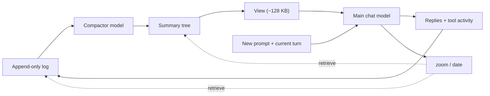

# OptChat for pi

An endless chat where the AI remembers everything, implemented as a pi
extension.

Every message of every turn — the user's words, the replies, the tool
calls and their results — is appended to an append-only log (tool output is clipped).
In the background, the session model compresses the log into a binary tree
of one-line summaries. Each turn starts fresh: instead of the whole
transcript, the model sees a fixed-size *view* (~128 KB) of the whole
chat — recent messages one line each, older ones many per line — plus
the current turn's messages verbatim. Anything from the whole history
is a few `zoom` calls away.

## Flow

The view summarizes earlier turns; the current turn's messages stay verbatim.

## Storage

The memory lives per project, in `<cwd>/.pi/optchat/`: an append-only
`main/` and `tree/` (one JSONL file per day), `view.json` (the saved
views, validated and restored at start; rebuilt if missing or invalid), `images/` (attachments), and
`lock` (the single-writer socket). Commit it (it is the log of your
work with the agent) or ignore it, per project.

Failed log appends are rolled back before retrying. If rollback cannot be
confirmed, recording and compaction stop until `/reload` reconciles the disk log.

## Use

- Just chat. Nothing else to do; the memory builds itself.
- `/optchat` — status: messages, nodes, view size, compactor, cache-read token counters.
  Chat and compactor counters are provider-reported and reset on startup/reload.
- `/optchat view` — write the current view to `.pi/optchat/view.txt`.
- `/optchat note <text>` — add a note to the memory by hand.
- `/optchat resume` — restart a paused compactor (quota/auth errors).
- The model navigates its own memory with the `zoom(id, n)` and
  `date(id)` tools.

## Configuration

| Variable | Default | Meaning |
|---|---|---|
| `OPTCHAT_DIR` | `<cwd>/.pi/optchat` | Where the log lives |
| `OPTCHAT_MODEL` | Session model at startup/reload | Compactor override, `provider/model` |
| `OPTCHAT_DISABLE` | unset | Any value turns the memory off |

Only one pi process writes a log (a Unix-socket lock); a second one on
the same project runs with the memory disabled.

## How it maps onto pi

| OptChat (spec) | Here |
|---|---|
| Turn loop, fresh call per turn | `before_agent_start` + `context` events |
| The log | `message_end` / `tool_execution_*` events → JSONL |
| The compactor | ready queues → `streamSimple(...).result()`, with its own 16-32 KB view |
| zoom, date tools | `pi.registerTool` |
| Wait for summaries (§6) | `before_agent_start` awaits `settle()` (≤ 2 min) |

Pi's own session file and compaction are left alone: the session is
just the current turn's scratch, the log is the real memory. Start a
new pi session whenever; the OptChat view carries over.

## Deviations from the spec

- **Per-project chat**, not one global chat (pi's cwd scopes it; like
  AGENTS.md). `OPTCHAT_DIR` escapes that.
- **Settle timeout (2 min).** The spec lets the wait run forever; a
  plugin must not brick the harness. A stuck or paused compactor keeps
  pi's original transcript for that turn instead of injecting placeholders.
  Other sessions' memories may be unavailable until compaction resumes.
- **Tool outputs are clipped** to 30,000 characters (head and tail);
  every other long text is never cut, but split over several messages.
  User, custom-message and tool-result images are saved as files; memory
  notes give absolute paths for pi's `read` tool (zoom returns text, not images).
- **zoom(id, 1) renders `id+1|`**, not the spec's `id+0|`, so a
  one-message line reads the same as in the view.
- **No manual cache breakpoints.** Pi's provider layer owns caching;
  the batched views (64-128 KB chat, 16-32 KB compaction) and constant
  prompts aim to stabilize prefixes. Shared-prefix cache savings between
  the chat and compactor are not guaranteed. `/optchat` reports cache-read
  tokens against total prompt tokens for each, rather than assuming savings.
- **Compactor model** defaults to the session model and its configured
  authentication, not Claude Sonnet; choose a cheaper model with `OPTCHAT_MODEL`.
  Quota or auth failures pause it (`/optchat resume`) instead of retrying.

## Tests

From this directory: `node --experimental-strip-types test/optchat.test.mjs`.
The regression suite uses a mocked compactor; it makes no network calls.

For loader/API integration tests (also mocked):
`node test/integration.test.mjs /path/to/@earendil-works/pi-coding-agent`.
The argument is the installed package directory, not its CLI executable.
