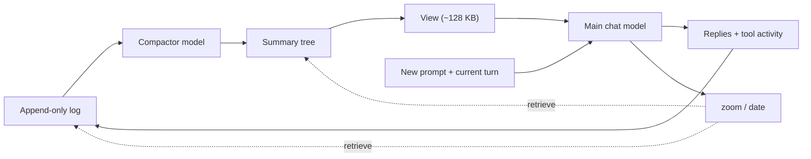

# OptChat for pi

An endless chat where the AI remembers everything, implemented as a pi
extension. The full design and the spec this implements live in
[`optchat.md`](../optchat.md).

Every message of every turn — the user's words, the replies, the tool
calls and their results — is appended verbatim to an append-only log.
In the background, the session model compresses the log into a binary tree
of one-line summaries. Each turn starts fresh: instead of the whole
transcript, the model sees a fixed-size *view* (~128 KB) of the whole
chat — recent messages one line each, older ones many per line — plus
the current turn's messages verbatim. Anything from the whole history
is a few `zoom` calls away.

## Flow



The view summarizes earlier turns; the current turn's messages stay verbatim.

## Install

```
ln -s ~/projects/dotfiles/optchat ~/.pi/agent/extensions/optchat
```

The memory lives per project, in `<cwd>/.pi/optchat/` (an append-only
`main/` and `tree/`, one JSONL file per day). Commit it (it is the log
of your work with the agent) or ignore it, per project.

## Use

- Just chat. Nothing else to do; the memory builds itself.
- `/optchat` — status: messages, nodes, view size, compactor.
- `/optchat view` — write the current view to `.pi/optchat/view.txt`.
- `/optchat note <text>` — add a note to the memory by hand.
- The model navigates its own memory with the `zoom(id, n)` and
  `date(id)` tools.

## Configuration

| Variable | Default | Meaning |
|---|---|---|
| `OPTCHAT_DIR` | `<cwd>/.pi/optchat` | Where the log lives |
| `OPTCHAT_MODEL` | Session model at startup/reload | Compactor override, `provider/model` |
| `OPTCHAT_DISABLE` | unset | Any value turns the memory off |

Only one pi process writes a log (a Unix-socket lock); a second one on
the same project runs with the memory disabled.

## How it maps onto pi

| OptChat (spec) | Here |
|---|---|
| Turn loop, fresh call per turn | `before_agent_start` + `context` events |
| The log | `message_end` / `tool_execution_*` events → JSONL |
| The compactor | background pump → `modelRegistry.streamSimple(...).result()` |
| zoom, date tools | `pi.registerTool` |
| Wait for summaries (§6) | `before_agent_start` awaits `settle()` (≤ 2 min) |

Pi's own session file and compaction are left alone: the session is
just the current turn's scratch, the log is the real memory. Start a
new pi session whenever; the OptChat view carries over.

## Deviations from the spec

- **Per-project chat**, not one global chat (pi's cwd scopes it; like
  AGENTS.md). `OPTCHAT_DIR` escapes that.
- **Settle timeout (2 min).** The spec lets the wait run forever; a
  plugin must not brick the harness, so a stuck compactor degrades to
  "(not summarized yet)" lines and a warning.
- **Tool inputs are capped** at 30,000 characters like tool results
  (they land in the permanent log too).
- **zoom(id, 1) renders `id+1|`**, not the spec's `id+0|`, so a
  one-message line reads the same as in the view.
- **No manual cache breakpoints.** Pi's provider layer owns caching;
  the frozen view and constant prompts give it the same stability.
- **Compactor model** defaults to the session model and its configured
  authentication, not Claude Sonnet; choose a cheaper model with `OPTCHAT_MODEL`.
